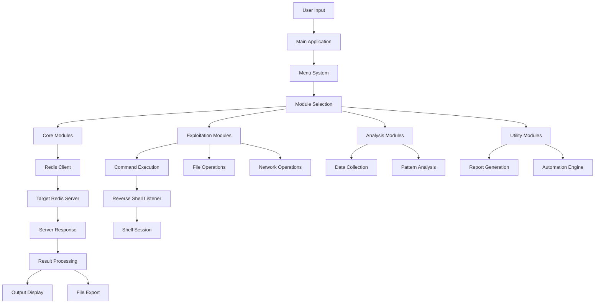
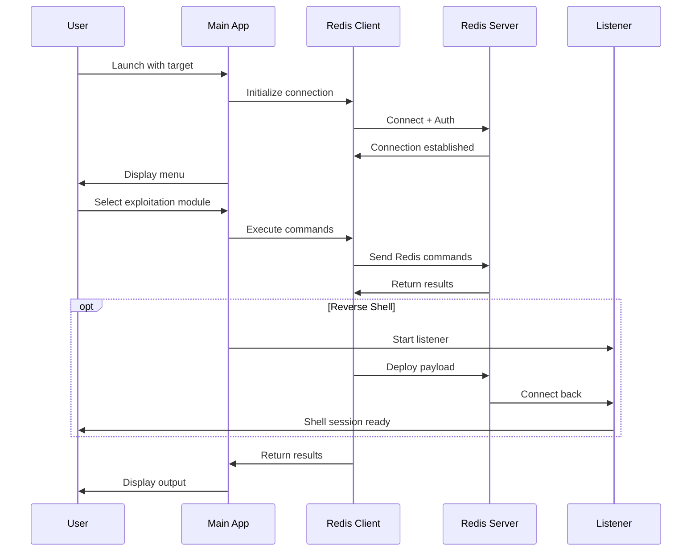
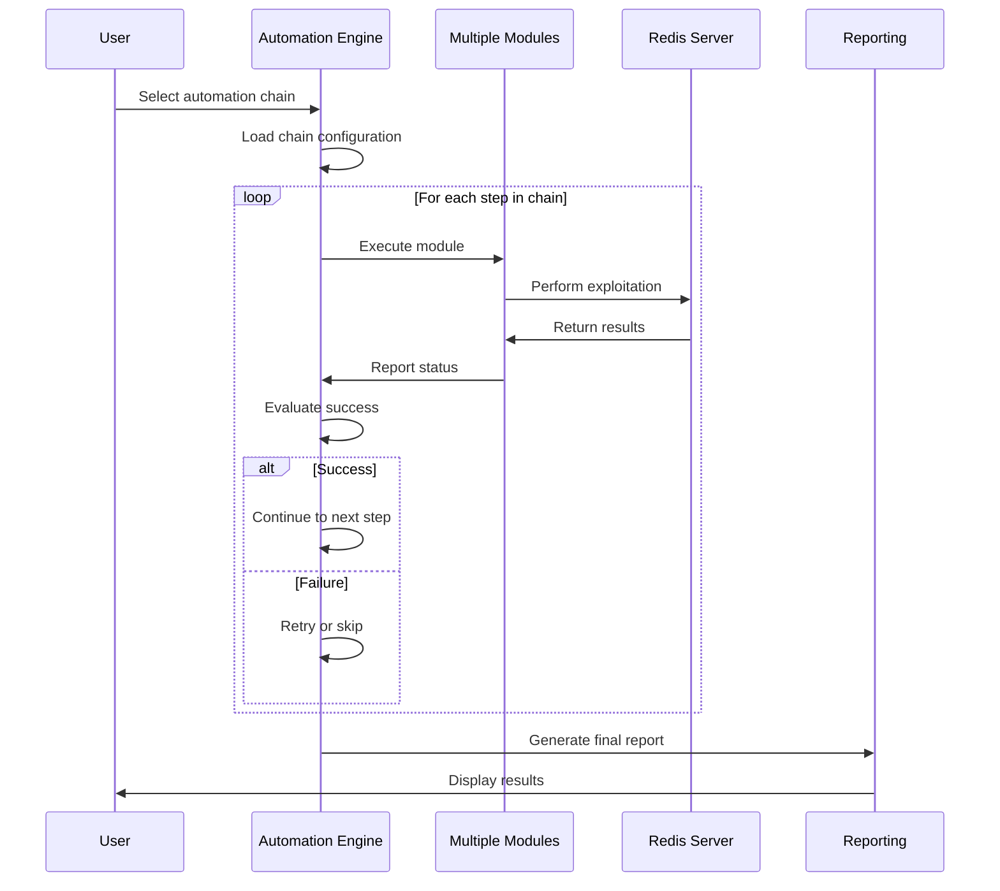

# 0xRedisis - Advanced Redis CTF Exploitation Tool v2.0

A comprehensive, modular Redis exploitation tool written in pure Go (1.21+), designed for CTF (Capture The Flag) scenarios, security testing, and educational purposes. Zero third-party dependencies required.

## 🚀 Key Features

### 🎯 Basic Exploitation
- **Reconnaissance**: Comprehensive server information gathering including version, config, memory stats, keyspace analysis, and security assessments
- **Web Shell Injection**: Multi-format PHP payload injection with smart directory detection, reverse shell capabilities, and persistence mechanisms
- **SSH Key Injection**: Automated RSA key generation with multi-path injection strategies targeting authorized_keys in multiple locations
- **Database Dumping**: Complete data exfiltration with multiple export formats (JSON, CSV, plain text) and web-accessible file generation
- **Cron Job Injection**: Persistent backdoor establishment through scheduled task injection with reverse shell automation

### 🔥 Advanced Exploitation  
- **Lua Script Exploitation**: Advanced command execution through Lua scripting with file operations, network requests, and sandbox escape techniques
- **Master-Slave Replication Abuse**: Sophisticated persistence through Redis replication manipulation and malicious slave configuration
- **Redis Module Exploitation**: Dynamic C module compilation and loading for advanced system-level exploitation
- **Sandbox Bypass**: Multiple techniques to escape Lua security restrictions and gain system access

### 🧠 Intelligence & Analysis
- **Smart Data Exfiltration**: AI-powered pattern recognition for sensitive data detection (passwords, API keys, PII, financial data)
- **Real-time Monitoring**: Live key change detection with alerting and automatic data capture
- **Network Analysis**: Redis cluster enumeration, sentinel discovery, and multi-instance exploitation coordination
- **Automated Reporting**: Comprehensive HTML/JSON/PDF report generation with timeline analysis and remediation recommendations

### 🤖 Automation & Utilities
- **Exploitation Chains**: Five pre-configured automated attack sequences including full assessment, custom chains, mass exploitation, persistence establishment, and data exfiltration pipelines
- **Payload Generation**: Cross-platform payload creation supporting Linux, Windows, macOS, Docker with obfuscation and encoding options
- **Success Verification**: Automated confirmation of exploitation success with health checks and persistence validation

## 📁 Project Architecture

```
0xRedisis/
├── main.go                           # Application entry point with argument parsing
├── go.mod                           # Go module definition (Go 1.21+)
├── modules/
│   ├── core/                        # Core framework components
│   │   ├── client.go               # Pure Go Redis RESP protocol client
│   │   ├── menu.go                 # Interactive menu system
│   │   ├── listener.go             # Automated reverse shell listener
│   │   └── utils.go                # Common utilities and IP detection
│   ├── exploitation/                # Attack modules
│   │   ├── reconnaissance.go        # Information gathering and enumeration
│   │   ├── webshell.go             # Web shell injection techniques  
│   │   ├── lua.go                  # Lua script exploitation engine
│   │   ├── replication.go          # Master-slave replication abuse
│   │   └── modules.go              # Redis module exploitation
│   ├── persistence/                 # Persistence mechanisms
│   │   ├── ssh.go                  # SSH key injection module
│   │   └── cron.go                 # Cron job persistence module
│   ├── analysis/                    # Intelligence and analysis
│   │   ├── database.go             # Database dumping and export
│   │   ├── exfiltration.go         # Smart data exfiltration engine
│   │   └── network.go              # Network scanning and cluster analysis
│   └── utils/                       # Utilities and automation
│       ├── reporting.go            # Comprehensive reporting system
│       ├── automation.go           # Automated exploitation chains
│       └── payloads.go             # Payload generation engine
├── reports/                         # Generated reports directory
├── legacy/                          # Original Bash implementation (reference)
└── docs/                           # Documentation and diagrams
    ├── DFD.md                      # Data Flow Diagram
    └── sequence-diagram.md         # Sequence Diagrams
```

## 🛠 Installation & Requirements

### Prerequisites
- **Go 1.21+** (latest stable version recommended)
- **No external dependencies** - pure Go standard library implementation
- **Cross-platform** - Works on Linux, Windows, macOS

### Quick Start

```bash
# Clone the repository
git clone https://github.com/yourusername/0xRedisis.git
cd 0xRedisis

# Initialize Go module (if needed)
go mod init 0xRedisis
go mod tidy

# Run directly without building (recommended for development)
go run main.go <host> <port> [password]

# Examples
go run main.go 192.168.1.100 6379                    # No authentication
go run main.go target.ctf.com 6379 secretpass        # With password
go run main.go localhost 6379                        # Local testing
```

### Building (Optional)

```bash
# Build for current platform
go build -ldflags="-s -w" -o redisis main.go

# Cross-compile for different platforms
GOOS=linux GOARCH=amd64 go build -ldflags="-s -w" -o redisis-linux main.go
GOOS=windows GOARCH=amd64 go build -ldflags="-s -w" -o redisis.exe main.go
GOOS=darwin GOARCH=amd64 go build -ldflags="-s -w" -o redisis-mac main.go
```

## 📋 Detailed Feature Descriptions

### 1. Reconnaissance Module
**What it does**: Comprehensive Redis server intelligence gathering
- **Server Information**: Version, uptime, architecture, OS details
- **Configuration Analysis**: Security settings, dangerous configs, bind addresses
- **Memory Analysis**: Usage patterns, key distribution, memory optimization
- **Keyspace Enumeration**: Database statistics, key patterns, data types
- **Security Assessment**: Authentication status, command restrictions, module loading
- **Client Information**: Connected clients, blocked clients, network statistics

### 2. Web Shell Injection
**What it does**: Injects malicious PHP shells through Redis file writes
- **Multiple Shell Types**: Simple shells, feature-rich shells, reverse shells, bind shells
- **Smart Directory Detection**: Automatically discovers web-accessible directories
- **Persistence Options**: Creates multiple backup shells for reliability
- **Reverse Shell Integration**: Built-in listener with automatic IP detection
- **Encoding Support**: Base64, URL encoding for evasion
- **Cleanup Functions**: Optional shell removal after use

### 3. SSH Key Injection  
**What it does**: Establishes SSH persistence through public key injection
- **Automatic Key Generation**: Creates RSA key pairs with configurable strength
- **Multi-path Targeting**: Tries multiple authorized_keys locations
- **User Enumeration**: Attempts injection for multiple system users
- **Backup Creation**: Preserves original authorized_keys when possible
- **Permission Handling**: Sets correct file permissions for SSH compatibility
- **Connection Testing**: Verifies successful key injection

### 4. Database Dumping
**What it does**: Extracts and exports Redis database contents
- **Complete Enumeration**: Scans all databases and keys
- **Multiple Export Formats**: JSON, CSV, plain text, Redis commands
- **Web-accessible Output**: Creates files in web directories for easy retrieval
- **Selective Dumping**: Filter by key patterns, data types, or databases
- **Large Dataset Handling**: Memory-efficient processing for big databases
- **Structured Output**: Organized by database and data type

### 5. Cron Job Injection
**What it does**: Establishes persistent access through scheduled tasks
- **Reverse Shell Scheduling**: Automated callback establishment
- **Multiple Cron Locations**: System-wide and user-specific crontabs
- **Stealth Options**: Disguised commands and random scheduling
- **Persistence Verification**: Checks if cron jobs are successfully installed
- **Cleanup Scheduling**: Optional self-removing jobs
- **Shell Encoding**: Obfuscated payload delivery

### 6. Lua Script Exploitation
**What it does**: Executes system commands through Lua scripting engine
- **Command Execution**: Direct system command execution via io.popen()
- **File Operations**: Read, write, delete files on the target system  
- **Network Operations**: HTTP requests, port scanning, data exfiltration
- **Reverse Shells**: Lua-based reverse shell establishment
- **Sandbox Escape**: Multiple techniques to bypass Lua restrictions
- **Persistent Backdoors**: Install permanent Lua-based access methods

### 7. Master-Slave Replication Abuse
**What it does**: Exploits Redis replication for advanced persistence
- **Master Configuration**: Sets up malicious master server
- **Slave Manipulation**: Forces target to replicate from attacker
- **Module Injection**: Loads malicious modules through replication
- **Config Persistence**: Modifies Redis configuration permanently
- **Multi-target Coordination**: Synchronizes attacks across cluster
- **Stealth Replication**: Minimizes detection through careful timing

### 8. Redis Module Exploitation  
**What it does**: Loads and exploits custom Redis modules
- **Dynamic Module Creation**: Generates C modules with malicious functions
- **Compilation Integration**: Compiles modules on-the-fly
- **System-level Access**: Module-based privilege escalation
- **Persistence Mechanisms**: Module-based backdoors
- **Function Hooking**: Intercepts Redis operations
- **Memory Manipulation**: Direct memory access through modules

### 9. Smart Data Exfiltration
**What it does**: Intelligently identifies and extracts sensitive data
- **Pattern Recognition**: Detects passwords, API keys, tokens, PII
- **Data Classification**: Categorizes found data by sensitivity level  
- **Export Options**: Multiple output formats with encryption
- **Real-time Monitoring**: Watches for new sensitive data
- **False Positive Filtering**: Reduces noise through intelligent filtering
- **Compliance Reporting**: Generates reports for regulatory requirements

### 10. Network Analysis
**What it does**: Discovers and analyzes Redis infrastructure
- **Cluster Discovery**: Maps Redis cluster topology
- **Sentinel Detection**: Identifies Redis Sentinel configurations
- **Port Scanning**: Discovers additional Redis instances
- **Service Fingerprinting**: Identifies Redis versions and configurations
- **Network Mapping**: Creates infrastructure diagrams
- **Mass Exploitation**: Coordinates attacks across multiple targets

### 11. Comprehensive Reporting
**What it does**: Generates detailed exploitation reports
- **Timeline Analysis**: Chronological attack progression
- **Evidence Collection**: Screenshots, command outputs, files
- **Risk Assessment**: Prioritized vulnerability ratings
- **Remediation Guidance**: Specific fix recommendations
- **Multiple Formats**: HTML, JSON, PDF outputs
- **Executive Summaries**: High-level business impact analysis

### 12. Automation Chains
**What it does**: Executes complex multi-stage attacks automatically
- **Full Assessment**: Complete automated penetration test
- **Custom Chains**: User-defined attack sequences
- **Mass Exploitation**: Automated multi-target attacks
- **Persistence Establishment**: Automated backdoor deployment
- **Data Exfiltration Pipeline**: End-to-end data extraction

### 13. Payload Generator
**What it does**: Creates platform-specific and obfuscated payloads
- **Cross-platform Support**: Linux, Windows, macOS, Docker payloads
- **Multiple Payload Types**: Shells, backdoors, persistence mechanisms
- **Encoding Options**: Base64, hex, URL encoding
- **Obfuscation Techniques**: String manipulation, variable renaming
- **Steganography**: Hidden payload embedding
- **Custom Templates**: User-defined payload patterns

## 🔄 Data Flow Diagram (DFD)



## 🔄 Sequence Diagrams

### Basic Exploitation Flow


### Automated Chain Execution


## 🎯 Usage Examples

### Reconnaissance
```bash
# Launch tool and gather intelligence
go run main.go target.com 6379
# Select: 1 (Reconnaissance)  
# Choose: 1 (Full server reconnaissance)
# Output: Comprehensive server analysis with security assessment
```

### Web Shell Injection
```bash
# Connect and inject PHP shell
go run main.go vulnerable-server.com 6379
# Select: 2 (Inject PHP web shell)
# Choose: 2 (Feature-rich web shell)
# Enter web directory: /var/www/html
# Result: Shell accessible at http://target/shell.php
```

### Automated Exploitation Chain
```bash
# Run full automated assessment  
go run main.go redis-cluster.ctf 6379
# Select: 12 (Automation chains)
# Choose: 1 (Full automated assessment)
# Result: Complete penetration test with detailed report
```

### Smart Data Exfiltration
```bash
# Extract sensitive data automatically
go run main.go data-server.com 6379 password123
# Select: 9 (Smart data exfiltration)
# Choose: 1 (Quick sensitive data scan)
# Result: Categorized sensitive data export with risk ratings
```

## 🛡 Security & Compliance

### Ethical Use Requirements
This tool is strictly for:
- **CTF competitions** and security challenges
- **Authorized penetration testing** with written permission
- **Educational purposes** in controlled environments
- **Security research** on owned systems
- **Defensive security** improvement

### Legal Compliance
- ✅ Only test systems you own or have explicit authorization
- ✅ Comply with all applicable local and international laws
- ✅ Respect responsible disclosure practices
- ❌ Unauthorized access is illegal and unethical
- ❌ Users assume full responsibility for tool usage

### Technical Security Features
- **No credential storage** - all authentication is session-based
- **Secure communications** - supports Redis AUTH and SSL
- **Minimal footprint** - leaves minimal traces on target systems
- **Clean exit** - proper connection closure and cleanup
- **Audit logging** - comprehensive activity logging for compliance

## 🧪 Development & Testing

### Go Version Compatibility
- **Minimum**: Go 1.21 (uses latest language features)
- **Recommended**: Go 1.22+ (best performance and security)
- **Features Used**: Generics, error wrapping, context handling, structured logging

### Testing Commands
```bash
# Run all tests
go test ./...

# Test with race detection
go test -race ./...

# Benchmark performance  
go test -bench=. ./...

# Generate test coverage
go test -coverprofile=coverage.out ./...
go tool cover -html=coverage.out
```

### Code Quality
```bash
# Format code
go fmt ./...

# Lint code
golangci-lint run

# Vet code
go vet ./...

# Security scanning
gosec ./...
```

## 🚧 Development Roadmap

### ✅ Completed (v2.0)
- [x] Pure Go Redis client with RESP protocol
- [x] All 15 core exploitation modules
- [x] Automated reverse shell system
- [x] Smart data exfiltration engine
- [x] Comprehensive reporting system
- [x] Cross-platform compatibility
- [x] Automation and chaining system

### 🔄 In Progress (v2.1)
- [ ] Web-based GUI interface
- [ ] Plugin system for custom modules
- [ ] Multi-threading and concurrent exploitation
- [ ] Advanced evasion techniques
- [ ] Integration with security frameworks

### 📝 Future Releases (v3.0+)
- [ ] Machine learning for attack optimization  
- [ ] Distributed exploitation coordination
- [ ] Advanced persistence mechanisms
- [ ] Zero-day exploit integration
- [ ] Enterprise reporting features

## 🤝 Contributing

### Development Setup
1. Fork and clone the repository
2. Install Go 1.21+ and required tools
3. Create feature branch: `git checkout -b feature/amazing-feature`
4. Write tests for new functionality
5. Ensure all tests pass: `go test ./...`
6. Commit changes: `git commit -m 'Add amazing feature'`
7. Push branch: `git push origin feature/amazing-feature`
8. Create Pull Request with detailed description

### Contribution Guidelines
- **Code Quality**: Follow Go best practices and conventions
- **Testing**: Minimum 80% test coverage for new features
- **Documentation**: Update README and inline documentation  
- **Security**: No vulnerabilities or unsafe practices
- **Dependencies**: Maintain zero external dependencies
- **Modularity**: Follow existing architectural patterns

### Code Review Process
1. Automated tests must pass
2. Code review by at least one maintainer
3. Security review for exploitation modules
4. Performance impact assessment
5. Documentation completeness check

## 📄 License & Attribution

### License
This project is licensed under the MIT License - see the [LICENSE](LICENSE) file for complete terms.

### Attribution Requirements
- Maintain original copyright notices
- Credit original authors in derivative works
- Link back to original repository

### Third-party Components
- **None** - This project uses only Go standard library
- **Inspiration** - Original Bash implementation for reference
- **Protocols** - Redis RESP protocol implementation

## 🙏 Acknowledgments

### Security Community
- **CTF Community** - For innovative exploitation techniques
- **Redis Security Team** - For protocol documentation
- **Go Community** - For excellent standard library
- **Security Researchers** - For vulnerability research and responsible disclosure

### Educational Impact
- **Universities** - Using this tool for cybersecurity education
- **Training Organizations** - Incorporating into penetration testing curricula  
- **CTF Organizers** - Creating realistic Redis challenges

## 📞 Support & Community

### Getting Help
- **Issues**: Create GitHub issue for bugs or feature requests
- **Discussions**: Join community discussions in Issues section
- **Wiki**: Check project Wiki for additional documentation
- **Security**: Report security issues privately to maintainers

### Community Guidelines
- **Respectful Communication** - Professional and constructive feedback
- **Ethical Use** - Only discuss authorized testing scenarios
- **Knowledge Sharing** - Help others learn and improve
- **Responsible Disclosure** - Report vulnerabilities appropriately

---

## ⚡ Quick Reference

### Common Commands
```bash
# Basic reconnaissance
go run main.go <target> 6379

# Full automated assessment  
go run main.go <target> 6379 [password]
# Select: 12 → 1

# Generate custom payload
go run main.go <target> 6379  
# Select: 13 → 1

# Export complete database
go run main.go <target> 6379
# Select: 3 → 1
```

### Key Features Summary
| Module | Primary Function | Automation | Stealth |
|--------|------------------|------------|---------|
| Reconnaissance | Intelligence gathering | ✅ | ✅ |
| Web Shell | Remote access | ✅ | ⚠️ |
| SSH Keys | Persistence | ✅ | ✅ |
| Database Dump | Data extraction | ✅ | ✅ |
| Cron Jobs | Scheduled persistence | ✅ | ✅ |
| Lua Exploitation | Advanced access | ✅ | ⚠️ |
| Replication Abuse | Infrastructure control | ✅ | ✅ |
| Module Loading | System-level access | ⚠️ | ⚠️ |

**Legend**: ✅ Full support, ⚠️ Partial support, ❌ Not available

---

**⚠️ WARNING**: This tool contains powerful exploitation capabilities. Use responsibly and only with proper authorization.

**🎓 EDUCATIONAL**: Perfect for learning Redis security, Go programming, and penetration testing methodologies.

**🏆 CTF OPTIMIZED**: Specifically designed for Capture The Flag competitions with comprehensive Redis exploitation capabilities.

**🔒 SECURITY FOCUSED**: Built with security best practices and responsible disclosure principles in mind.