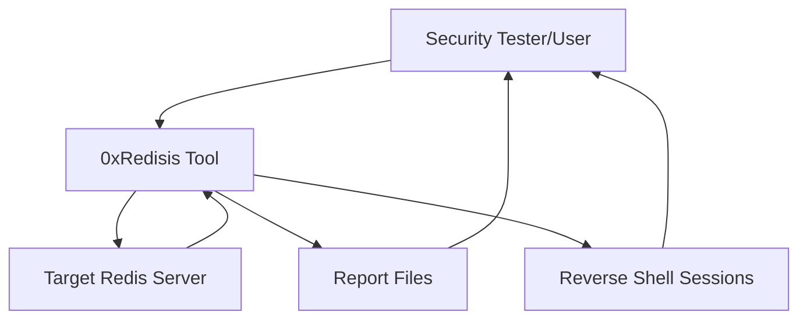
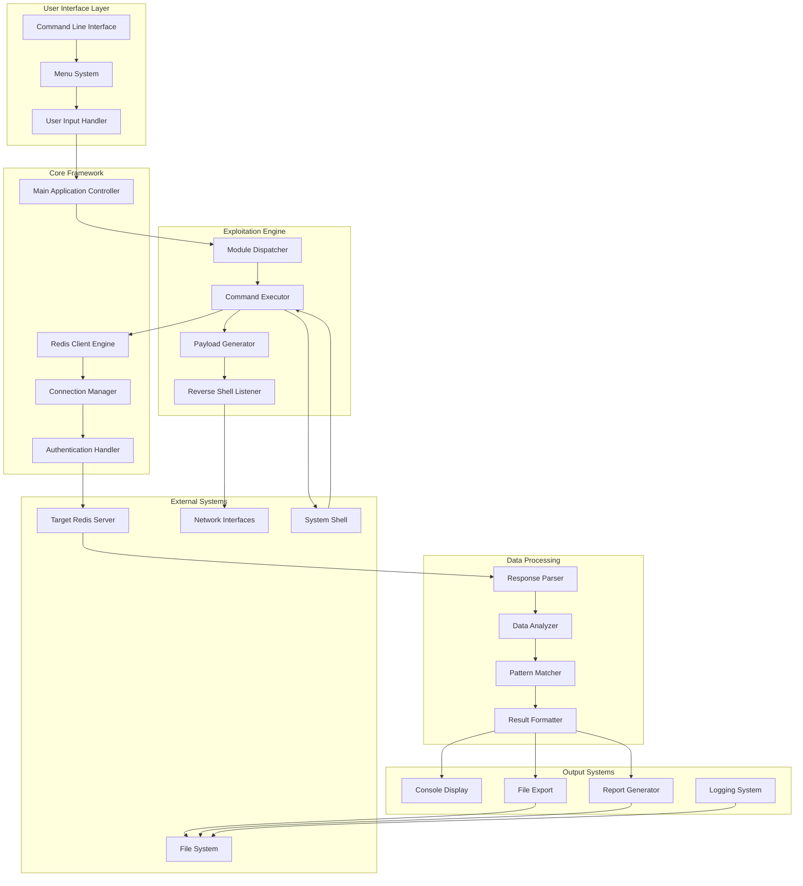
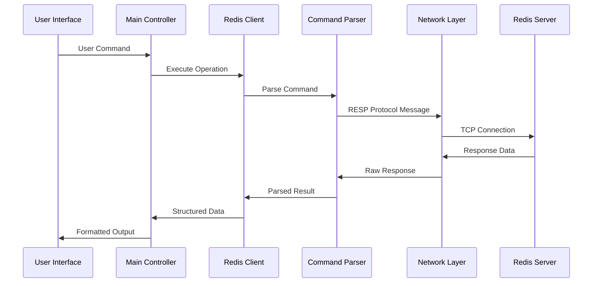
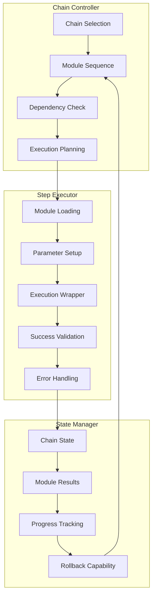
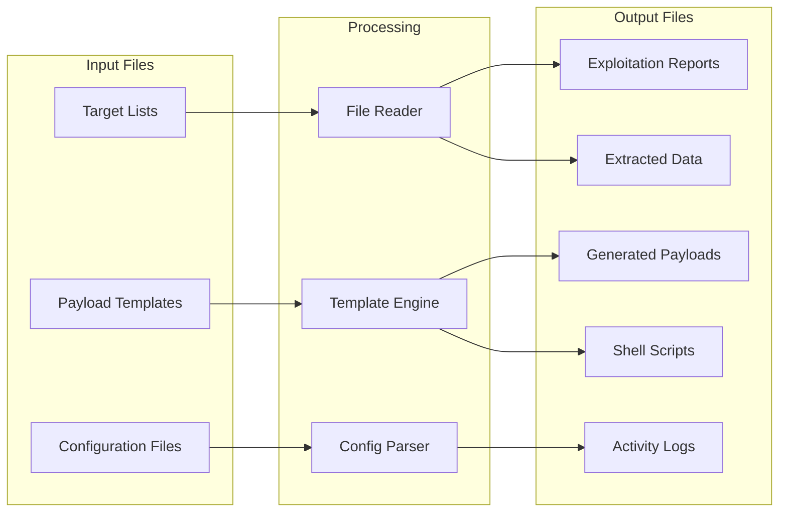
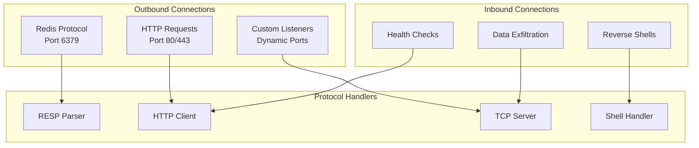
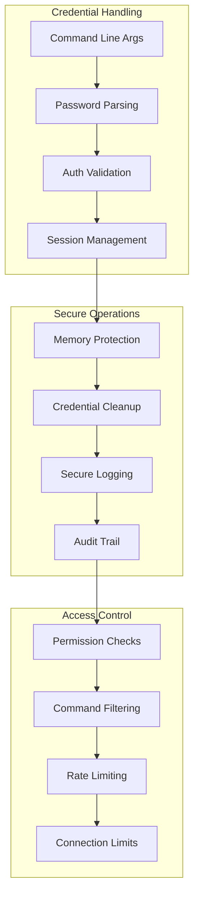

# Data Flow Diagram (DFD) - 0xRedisis Redis Exploitation Tool

## Level 0 - Context Diagram

## Level 1 - System Overview

## Level 2 - Detailed Module Flow

### Exploitation Module Data Flow

```mermaid
graph LR
    subgraph "Reconnaissance Module"
        A1[Server Info Request] --> A2[CONFIG GET *]
        A2 --> A3[INFO Command]
        A3 --> A4[CLIENT LIST]
        A4 --> A5[Memory Analysis]
        A5 --> A6[Keyspace Stats]
    end
    
    subgraph "Web Shell Module"
        B1[Directory Detection] --> B2[Payload Selection]
        B2 --> B3[Shell Generation]
        B3 --> B4[File Write Command]
        B4 --> B5[Persistence Check]
    end
    
    subgraph "SSH Key Module"
        C1[Key Generation] --> C2[Path Enumeration]
        C2 --> C3[authorized_keys Write]
        C3 --> C4[Permission Setting]
        C4 --> C5[Connection Test]
    end
    
    subgraph "Database Module"
        D1[Database Scan] --> D2[Key Enumeration]
        D2 --> D3[Data Extraction]
        D3 --> D4[Format Conversion]
        D4 --> D5[Export Generation]
    end
    
    subgraph "Lua Script Module"
        E1[Script Selection] --> E2[Command Wrapping]
        E2 --> E3[EVAL Execution]
        E3 --> E4[Output Parsing]
        E4 --> E5[Shell Handling]
    end
```

### Analysis Module Data Flow

```mermaid
graph TD
    subgraph "Smart Data Exfiltration"
        F1[Pattern Library] --> F2[Key Scanning]
        F2 --> F3[Content Analysis]
        F3 --> F4[Sensitivity Scoring]
        F4 --> F5[Classification]
        F5 --> F6[Export Preparation]
    end
    
    subgraph "Network Analysis"
        G1[Port Scanning] --> G2[Service Detection]
        G2 --> G3[Cluster Discovery]
        G3 --> G4[Topology Mapping]
        G4 --> G5[Multi-target Planning]
    end
    
    subgraph "Reporting System"
        H1[Activity Logging] --> H2[Evidence Collection]
        H2 --> H3[Timeline Generation]
        H3 --> H4[Risk Assessment]
        H4 --> H5[Report Templates]
        H5 --> H6[Multi-format Export]
    end
```

## Level 3 - Core Component Interactions

### Redis Client Communication Flow

### Automated Chain Execution Flow

## Data Store Interactions

### File System Operations

### Network Communications

## Security Data Flow

### Authentication and Authorization

## Performance and Monitoring Flow

### Resource Management

```mermaid
graph LR
    subgraph "Resource Monitoring"
        U1[Memory Usage] --> U2[Connection Pool]
        U2 --> U3[Thread Management]
        U3 --> U4[Timeout Handling]
    end
    
    subgraph "Performance Optimization"
        V1[Concurrent Operations] --> V2[Batch Processing]
        V2 --> V3[Result Caching]
        V3 --> V4[Lazy Loading]
    end
    
    subgraph "Error Recovery"
        W1[Connection Recovery] --> W2[Retry Logic]
        W2 --> W3[Graceful Degradation]
        W3 --> W4[Cleanup Operations]
    end
    
    U4 --> V1
    V4 --> W1
```

## Summary

This DFD illustrates the complete data flow architecture of the 0xRedisis tool, showing how data moves through the system from user input to final output. The multi-level approach provides both high-level system understanding and detailed component interactions, ensuring comprehensive coverage of all data processing aspects.

Key characteristics:
- **Modular Design**: Clear separation of concerns across different processing layers
- **Bidirectional Flow**: Data flows both to and from the target Redis server
- **Security Focus**: Proper handling of sensitive authentication data
- **Scalability**: Support for concurrent operations and batch processing
- **Reliability**: Error handling and recovery mechanisms throughout the flow
- **Extensibility**: Pluggable module architecture for easy feature additions